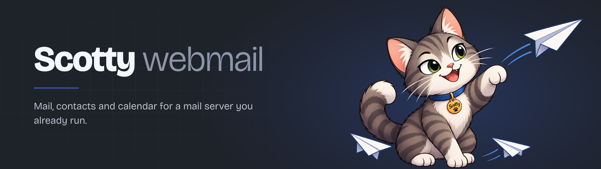
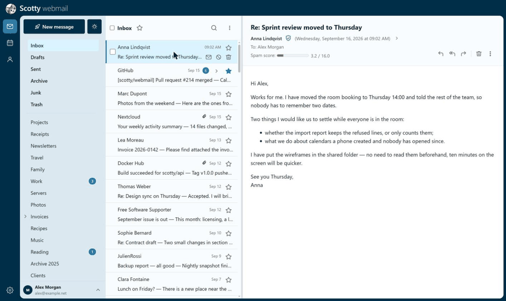
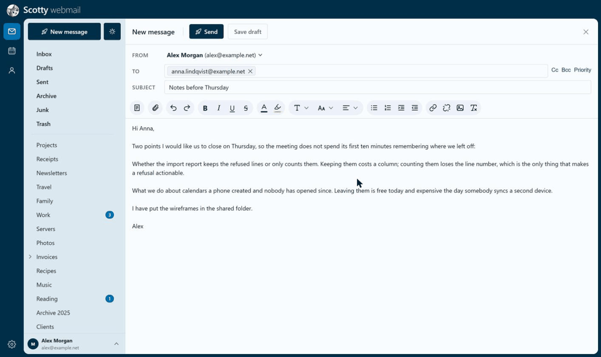
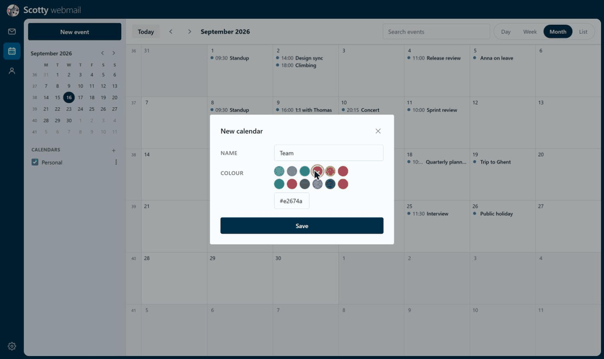
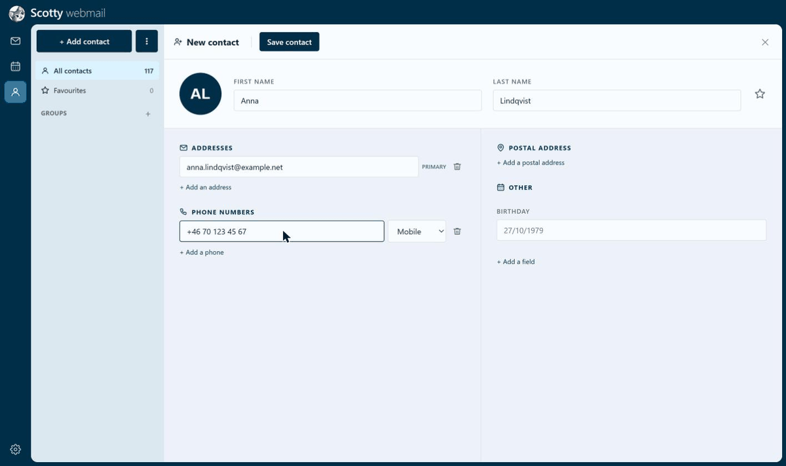

<p align="center">
  
</p>

<p align="center">
  <a href="https://github.com/darthmaul0181/weesky.net-mail/actions/workflows/deploy.yml"></a>
  
  
  
</p>

---

## What this is

A **webmail for a mail service you already have**. Point it at any IMAP and SMTP server and it gives
its users a browser client — mail, an address book and a calendar — without moving a single
mailbox anywhere.

Two things set it apart from a mail client you install on your machine:

- **It keeps no copy of your mail.** Every folder, message and flag is read from IMAP at the
  moment you ask for it. Scotty's own database holds only what IMAP has nowhere to put —
  preferences, sending identities, contacts, calendars.
- **It never learns your password.** Signing in *is* an IMAP login: the mail server decides. The
  password is then kept in a cookie the service encrypts, and thrown away when you sign out. There
  is no password column to leak, because there is no password column.

And because your phone does not speak IMAP for contacts and calendars, Scotty **is** the CardDAV
and CalDAV server for them. The same address book you edit in the browser is the one that syncs to
iOS, DAVx⁵ and Thunderbird.

## What it does

**Mail** — folders with their system roles resolved (Sent, Drafts, Trash, Junk, Archive), a message
list that can group conversations, flags and the usual actions, multi-select, IMAP search. Compose
in HTML or plain text, with drag-and-drop attachments, inline images and a priority flag. Drafts,
reply, reply-all, forward, and a curated list of sending identities. Remote images are withheld
until you allow them, once or for that sender for good. New mail can ring and raise a desktop
notification.

**Several mailboxes at once** — attach another mailbox of the same mail service to your session; on
the `weesky` platform, also one on an external domain, with a password or through OAuth.

**Contacts** — a complete vCard model rather than a handful of columns, so nothing an imported card
carried is lost on the way in or out. Photos, groups, CSV import and export, bulk actions, and
addresses captured from the people you write to.

**Calendar** — day, week, month and a list view, recurring events, several calendars with their own colours.
Invitations go out to guests and come back in; on the `weesky` platform, a guest's reply is applied
**as the mail is delivered**, so the calendar is right before you open anything.

**Mail rules** — the Sieve script your server already runs, edited from the browser over ManageSieve.

**The interface** — English and French, light and dark, eight colour palettes, installable as an
application, and usable on a phone.

## Two platforms

Scotty comes in two flavours, chosen by a single line of its settings. Everything above works in both
unless it says otherwise.

### `generic` — plug it into any mail service

Scotty is a webmail and nothing more. It reads and sends through whatever IMAP and SMTP service you
point it at — your own server or a provider — and needs nothing changed on the mail side. Mailboxes,
aliases and passwords stay managed wherever they are managed today.

This is the flavour [`install/README.md`](install/README.md) installs.

### `weesky` — the mail server and its webmail as one

Scotty also becomes the control panel of the mail server itself. That brings what a webmail bolted
onto someone else's server cannot offer:

- **One place for everyone.** Administrators create mailboxes, domains and aliases and set quotas
  from the same interface users read their mail in — no separate admin tool, no second login.
- **Self-service.** Users change their own mail password and display name, and manage their own
  aliases, without asking anyone.
- **Sending addresses you can trust.** Scotty knows every alias, so it offers each user exactly the
  addresses they own, and refuses the others itself instead of leaving it to the mail server.
- **Control that takes effect at once.** Disable a mailbox in the administration screens and its
  session ends on its very next action.
- **The features that need an administrator.** The product name, the account that sends calendar
  invitations for events edited on a phone, external mailboxes such as Outlook over OAuth, and
  guests' replies applied to the calendar as the mail is delivered.

The price is that it is built for one mail stack: Dovecot and Postfix, reading their mailboxes from a
MySQL or MariaDB database that Scotty administers.

> **More to come.** Setting up the `weesky` platform — the mail server it expects and how to
> install it — will be documented in a separate repository.

A side-by-side comparison is in
[the install guide](install/README.md#two-platforms-generic-or-weesky).

## Screens

<table>
<tr>
<td width="50%"><br><sub><b>Mail</b> — folders, list and reader, side by side</sub></td>
<td width="50%"><br><sub><b>Composing</b> — recipient tokens, a formatting toolbar, attachments by drag and drop</sub></td>
</tr>
<tr>
<td width="50%"><br><sub><b>Calendar</b> — several calendars, each with its own colour, served over CalDAV</sub></td>
<td width="50%"><br><sub><b>Contacts</b> — a full vCard behind the form, served over CardDAV</sub></td>
</tr>
</table>

<sub>Names, messages and folders in these screenshots are made up; the interface is the real one.</sub>

## Installing it

Scotty installs on a Linux server with a MySQL or MariaDB database and a web server such as Apache
or nginx, and connects to your mail service over IMAP and SMTP — your own server or a provider.
[`install/README.md`](install/README.md) walks through the `generic` platform in five steps, each
ending with a check:

1. **Build** the API and the web interface
2. **Create** Scotty's database with `install/install.sql`
3. **Run** the API as a systemd service, from the example unit and settings file
4. **Publish** both through your web server, on two addresses of the same domain
5. **Sign in** with any mailbox's address and password — there is no account to create

## Documentation

| | |
|---|---|
| [`install/README.md`](install/README.md) | **Start here to deploy.** Five steps, with an example systemd unit and environment file |
| [`docs/README.md`](docs/README.md) | Where everything else lives |
| [`docs/schema-notes.md`](docs/schema-notes.md) | Why the schema is shaped the way it is — read before changing a column or an index |
| [`docs/known-issues/`](docs/known-issues) | Defects found, measured and deliberately left open |
| [`docs/operations/`](docs/operations) | What to run after restoring a backup, and one-off migrations |
| [`docs/history/`](docs/history) | The design spec of every slice, dated and never revised |
| [`src/scotty.microservice/DESIGN.md`](src/scotty.microservice/DESIGN.md) | Backend architecture |
| [`DESIGN-rules.md`](DESIGN-rules.md) | The Sieve rules feature |
| [`assets/DATABASE.md`](assets/DATABASE.md) | The mail server's database, as the `weesky` platform administers it |

## Repository layout

```
weesky.net-mail/
├── install/                       # Everything a new deployment needs
│   ├── install.sql                #   the 26 tables, the database, the MySQL account
│   ├── README.md                  #   the five steps
│   └── optional/                  #   OAuth mailboxes, calendar replies at delivery
├── src/
│   ├── scotty.microservice/       # The core REST API — ASP.NET Core, .NET 10
│   ├── scotty.microservice.host/  #   composes the API with one platform provider
│   ├── scotty.providers.weesky/   #   the weesky provider: account and alias administration
│   └── frontend/                  # React + Vite SPA
├── docs/                          # Schema notes, known issues, operations, the record
├── assets/                        # Server-side notes, the SQL run on the mail host, the artwork
└── tools/                         # Brand icons, palette preview, the CalDAVTester harness
```

### Stack

ASP.NET Core (.NET 10), EF Core with the Pomelo MySQL provider, MailKit/MimeKit, Ical.Net, Serilog,
Swashbuckle. React 18 with Vite, TypeScript, TanStack Query and react-i18next. MySQL or MariaDB for Scotty's own
database.

## Licence

The code is under the **GNU Affero General Public License v3.0** — see [`LICENSE`](LICENSE).

AGPL rather than plain GPL because of what a webmail is likely to become: a service someone runs
for other people. The GPL asks nothing of an operator who never hands out a copy, and hosting is
not handing out a copy. Section 13 of the AGPL closes exactly that gap — offering a modified
version to users over a network counts as distribution, so whoever hosts a fork owes those users
its source.

The name **Scotty** and the artwork in [`assets/brand/`](assets/brand) are not covered by it: they
are the project's identity rather than its code, so a fork takes a name and a face of its own.

Copyright (C) 2026 [darthmaul0181](https://github.com/darthmaul0181)
